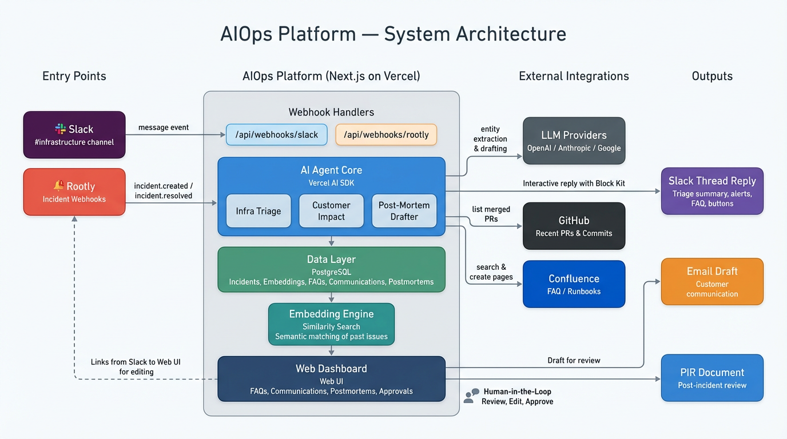
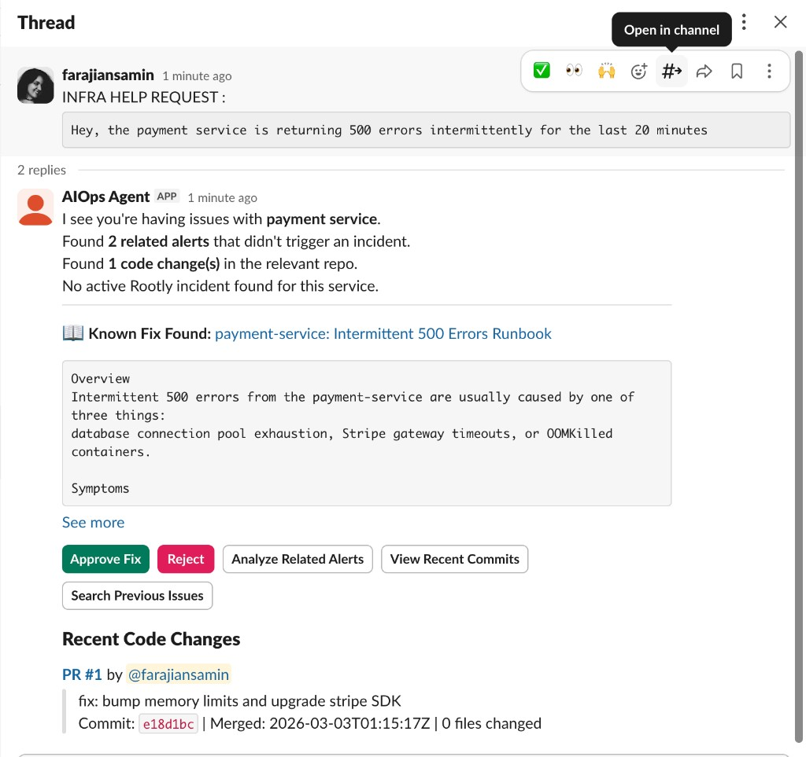
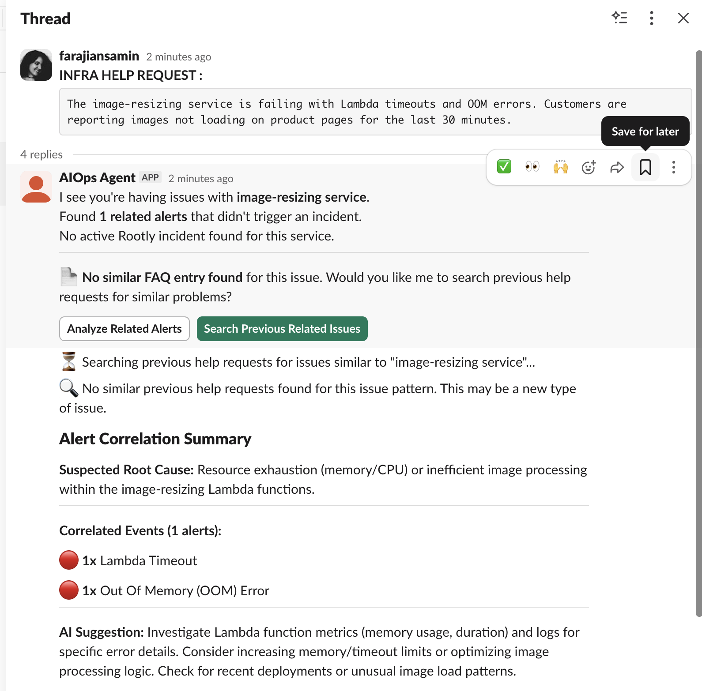
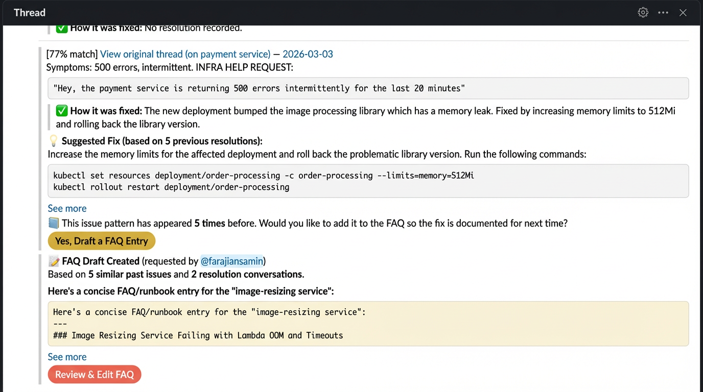
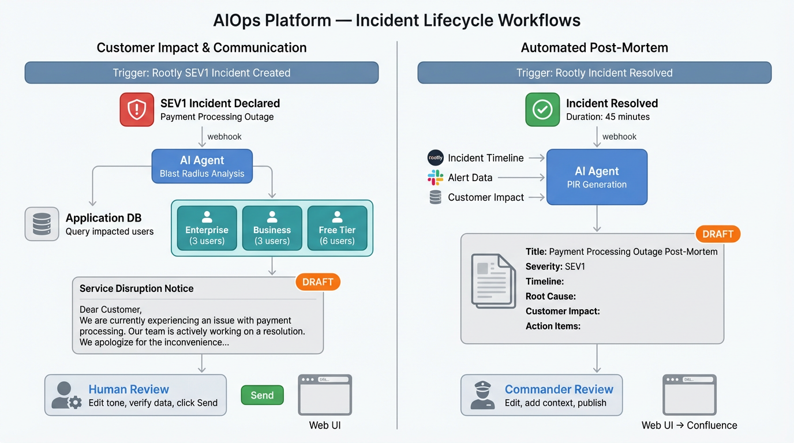
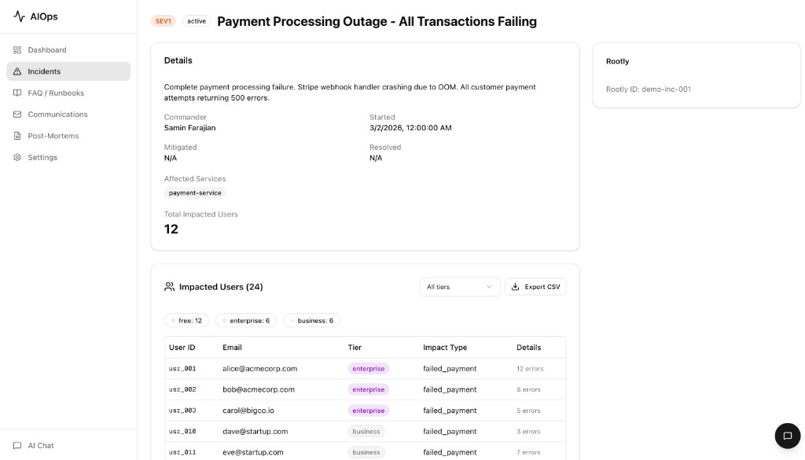

# AIOps Platform

**[Open Live App](https://aiops-platform.vercel.app)** | **[Watch Demo Video](https://drive.google.com/file/d/10UAYYRA6l3mVdnfPSxn7CXSfchy7XVWb/view?usp=sharing)**

AI-powered infrastructure operations assistant built with Next.js, Vercel AI SDK, and a hybrid MCP-ready architecture. Integrates with Slack, Rootly, Confluence, GitHub, and JIRA.

---

## The Problem

When a help request lands in #infrastructure — "The payment service is throwing 500 errors" — the on-call engineer has to manually check five different places: alerts, Rootly incidents, GitHub merges, Confluence docs, and old Slack threads. That takes 30-45 minutes, and the answer is usually buried in a thread reply from months ago.


This is what the #infrastructure channel looks like in practice — multiple help requests coming in, each needing the same manual investigation.


When someone does find the fix, it lives in a Slack thread that only they know about. The next time the same issue happens, the team starts from scratch.


Then there's the other side — the aftermath. After a major outage, the team rushes to fix it. Once things calm down: How many customers were affected? Which tier? How were they impacted? Answering that means manually querying databases and cross-referencing timestamps. Then comes writing a clear message to those customers. Under pressure, this work is slow, error-prone, and often delayed.


---

## How AIOps Helps

AIOps steps in to handle both problems. It works with [Rootly](https://rootly.com/) (an incident management platform for declaring incidents, tracking severity, and coordinating response) and extends into areas Rootly doesn't cover: pre-incident triage, cross-tool correlation, knowledge retrieval, customer impact analysis, and post-mortem drafting.



The platform sits between two entry points (**Slack** and **Rootly**) and multiple outputs (Slack replies, customer emails, post-mortem documents). It integrates with LLM providers for drafting, GitHub for recent commits, Confluence for FAQ search and creation, PostgreSQL for data storage, and an embedding engine for semantic matching of past issues.

---

## Two Core Use Cases


### Use Case 1: Infrastructure Triage & Knowledge Management

When a help request appears in #infrastructure, the agent investigates in seconds:

1. **Correlate Alerts** — Scans #alerts for related warnings, filters noise, and groups them into a summary.
2. **Check Rootly** — Queries for active or recent incidents on the affected service.
3. **View Recent Commits** — Looks up recently merged PRs in the service's GitHub repo.
4. **Search FAQ** — Checks Confluence for an existing runbook or known fix.
5. **Find Similar Past Issues** — Uses embedding-based semantic search across past Slack help requests, even across different services.
6. **Draft New FAQ** — If the same issue keeps coming up without documentation, the agent drafts a new Confluence FAQ page for human review.

**Scenario 1 — Known fix found:** The agent detects payment service 500 errors, finds a matching Confluence runbook, pulls recent GitHub commits, and gives the engineer everything they need in one thread reply.



**Scenario 2 — New issue, no FAQ:** The agent finds no existing documentation for the image-resizing service, correlates alerts (Lambda Timeout + OOM), and offers to search past help requests for similar patterns.



**Scenario 3 — Recurring pattern, FAQ drafted:** The agent finds similar past issues, suggests a fix based on previous resolutions, and drafts a new Confluence FAQ page for the team to review.



### Use Case 2: Incident Impact & Customer Communication

When a high-severity incident is declared via Rootly:

1. **Query Impact** — Connects to the application database to identify affected users within the incident window.
2. **Segment Users** — Breaks down impact by account tier (Enterprise, Business, Free).
3. **Draft Notification** — Writes a tailored customer email using incident context from Rootly and impact data from the database.
4. **Human Review** — The team reviews tone, verifies data, and sends from the web dashboard.



The web dashboard shows full incident details with impacted users broken down by tier, ready for review and export.



---

## Web Dashboard

The dashboard gives teams a single view of active incidents, pending approvals, and agent status. Slack handles fast, in-context triage; the web UI handles deeper work like editing FAQ drafts, reviewing customer impact tables, and approving post-mortems.


---

## Human-in-the-Loop

AI does the fast research. Humans make the final decisions. AIOps gathers alerts, checks Rootly context, finds similar past issues, estimates customer impact, and drafts fixes or emails. Humans decide what is safe to execute, what becomes official documentation, whether impact data is complete, how to escalate high-value customers, and when a customer message is approved and sent. This verification-first model gives speed without losing judgment, risk control, or accountability.

---

## Getting Started

### Prerequisites

- Node.js 20+
- PostgreSQL database
- At least one LLM API key (OpenAI, Anthropic, or Google)

### Setup

```bash
npm install
cp .env.example .env.local
npm run db:push
npm run dev
```

### Environment Variables

See `.env.example` for all options. At minimum:

| Variable | Required | Description |
|---|---|---|
| `OPENAI_API_KEY` or `ANTHROPIC_API_KEY` or `GOOGLE_GENERATIVE_AI_API_KEY` | Yes (one) | LLM provider API key |
| `POSTGRES_URL` | Yes | PostgreSQL connection URL |
| `SLACK_BOT_TOKEN` | For Slack | Slack Bot OAuth token |
| `SLACK_SIGNING_SECRET` | For Slack | Slack app signing secret |
| `ROOTLY_API_TOKEN` | For Rootly | Rootly API bearer token |
| `ATLASSIAN_HOST` | For JIRA/Confluence | Atlassian instance hostname |
| `ATLASSIAN_EMAIL` | For JIRA/Confluence | Atlassian account email |
| `ATLASSIAN_API_TOKEN` | For JIRA/Confluence | Atlassian API token |
| `GITHUB_TOKEN` | For GitHub | GitHub personal access token |

---

## Webhook Configuration

### Slack App

1. Create a Slack app at https://api.slack.com/apps
2. Enable Event Subscriptions: `https://your-domain/api/webhooks/slack/events`
3. Subscribe to `message.channels` events
4. Enable Interactivity: `https://your-domain/api/webhooks/slack/interactivity`
5. Bot scopes: `chat:write`, `channels:history`, `channels:read`, `reactions:read`, `users:read`
6. User scope: `search:read`
7. Set `SLACK_BOT_TOKEN` (`xoxb-...`) and `SLACK_USER_TOKEN` (`xoxp-...`)

### Rootly

1. Configure a webhook: `https://your-domain/api/webhooks/rootly`
2. Subscribe to incident lifecycle events

---

## Deploy on Vercel

```bash
npm i -g vercel
vercel
```

Or connect your GitHub repo for automatic deployments. Set all environment variables in Vercel dashboard under Project Settings > Environment Variables.

---

## Project Structure

```
src/
  app/                        # Next.js App Router
    (dashboard)/              # Web UI (dashboard, incidents, FAQ, etc.)
    api/                      # API routes (chat, webhooks, approvals)
  lib/
    agent/                    # AI agent core (model, prompts, tool registry)
    providers/                # Tool providers (slack, rootly, jira, confluence, github)
    workflows/                # Business logic (infra-triage, customer-impact, postmortem)
    db/                       # Drizzle ORM schema and queries
  components/                 # React UI components
```

## Adding a New Integration

1. Create `src/lib/providers/your-service/` with `index.ts`, `client.ts`, `tools.ts`, `types.ts`
2. Implement the `ToolProvider` interface in `index.ts`
3. Register it in `src/lib/agent/tools.ts` (conditionally, based on env vars)
4. The agent automatically gains access to the new tools

No changes needed to the agent core, workflows, or UI.
