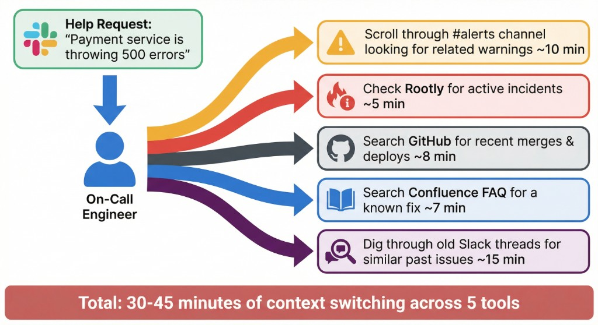
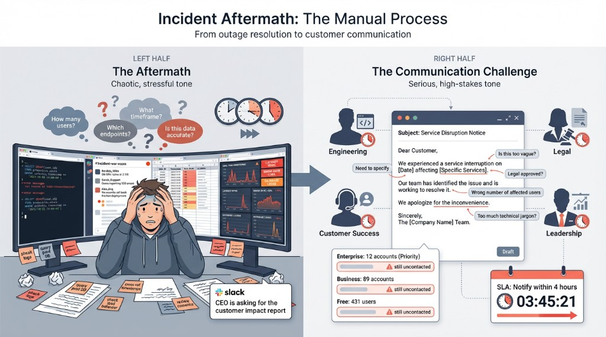
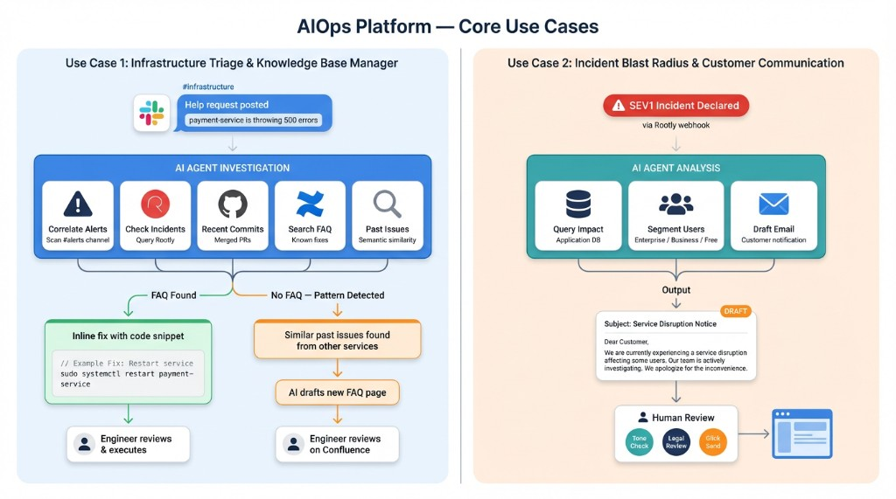
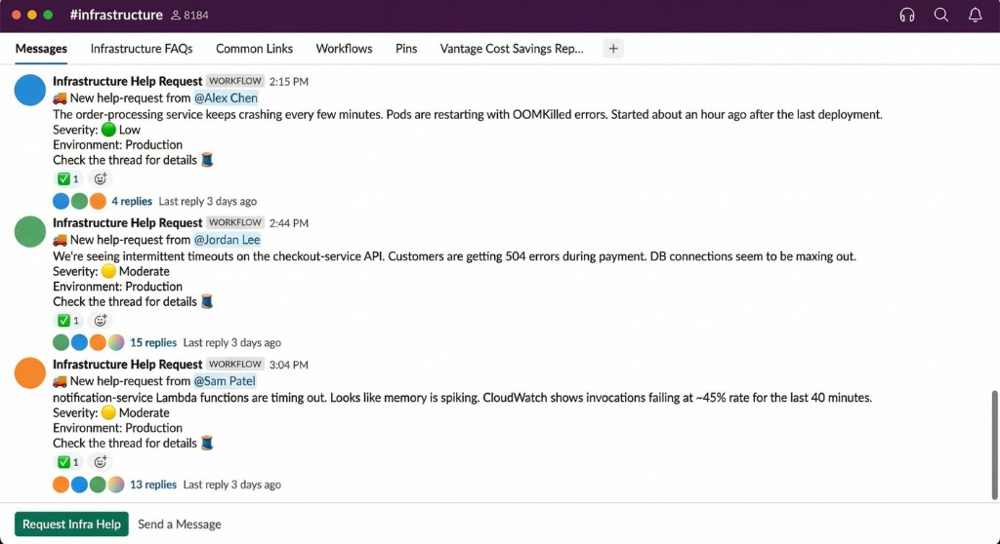
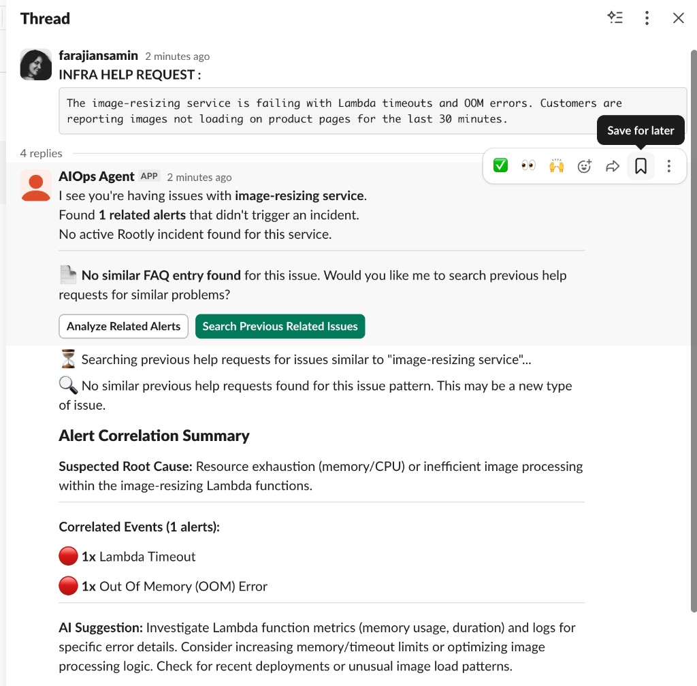
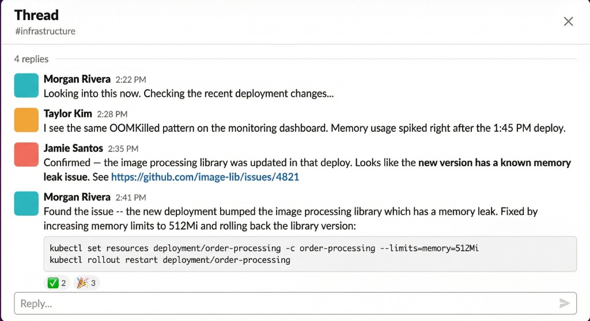
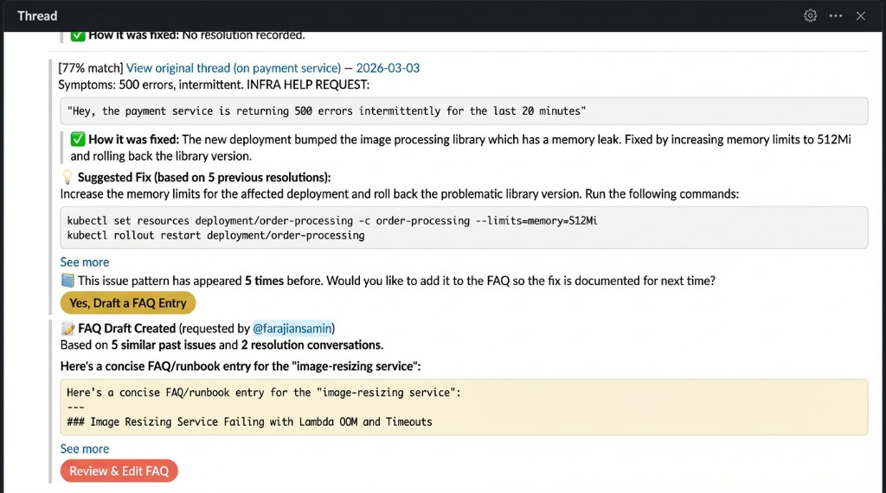
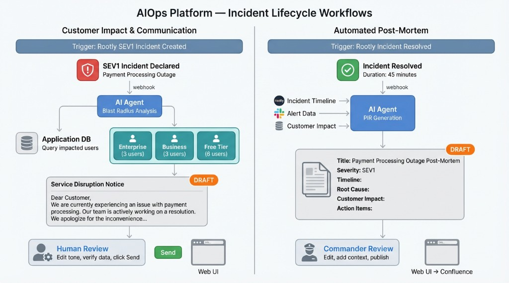
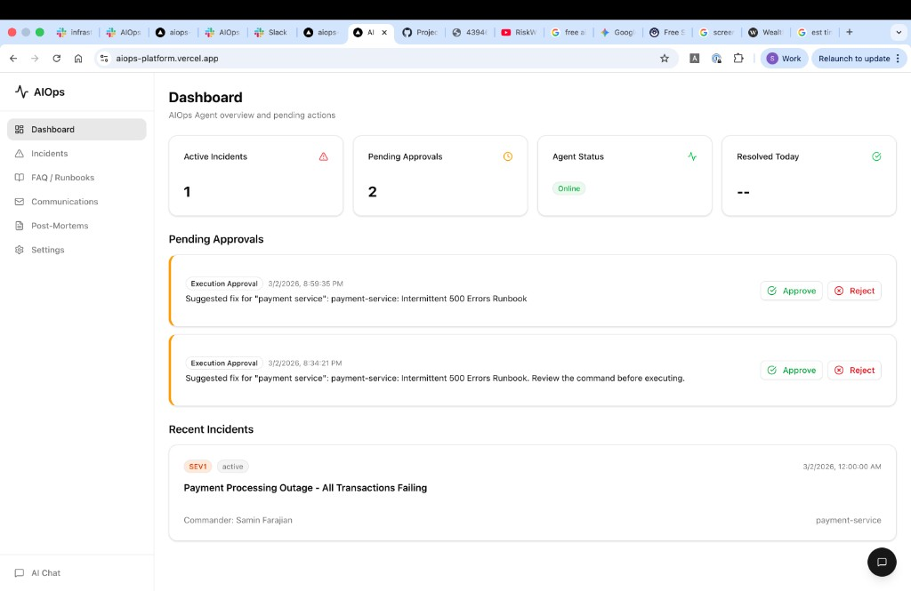

# AIOps Platform

**[Open Live App](https://aiops-platform.vercel.app)** | **[Watch Demo Video](./AIOps.mp4)**

AI-powered infrastructure operations assistant built with Next.js, Vercel AI SDK, and a hybrid MCP-ready architecture. Integrates with Slack, Rootly, Confluence, GitHub, and JIRA.

---

## Why This Exists

### The Problem

Imagine a help request lands in your #infrastructure channel: "The payment service is throwing 500 errors." The on-call engineer has to open five different tabs — scrolling through alerts, checking Rootly for active incidents, searching GitHub for recent merges, and digging through months of Slack history hoping someone has seen this before. That investigation takes 30-45 minutes, and the answer is usually buried in a thread reply. Every time an engineer leaves the team, that knowledge leaves with them.



Then there's the other side of incidents — the aftermath. After a major outage, the team rushes to fix it. Once things calm down, the same questions come up: How many customers were affected? Which tier? How exactly were they impacted? Answering that means manually querying databases, cross-referencing timestamps, and piecing together which users hit the broken endpoint. Then comes writing a clear message to those customers. Under pressure, this work is slow, error-prone, and often delayed.



### Where Rootly Fits — and Where the Gap Is

[Rootly](https://rootly.com/) orchestrates the incident lifecycle: declaring incidents, assigning commanders, tracking severity, and generating timelines. But Rootly operates at the *incident* level — it kicks in once something has been formally declared. The gap is everything that happens *before* and *around* an incident:

- A help request in Slack that hasn't escalated yet — Rootly doesn't see it.
- Correlating that request with noisy alerts in a separate channel — Rootly doesn't do this.
- Searching past Slack threads for how the team fixed the same problem before — outside Rootly's scope.
- Checking if a recent GitHub merge caused the regression — outside Rootly's scope.
- Drafting customer communications based on blast radius data — Rootly tracks incidents, not customer impact at the user level.

AIOps fills that gap. It integrates *with* Rootly (querying active incidents, receiving webhooks) while extending into areas Rootly doesn't cover: pre-incident triage, cross-tool correlation, knowledge retrieval, customer impact analysis, and post-mortem drafting.

---

## Two Core Use Cases



### Use Case 1: Infrastructure Triage & Knowledge Management

When a help request appears in #infrastructure, the agent investigates in seconds:

1. **Correlate Alerts** — Scans #alerts for related warnings, filters noise, and groups them into a summary.
2. **Check Rootly** — Queries for active or recent incidents on the affected service.
3. **View Recent Commits** — Looks up recently merged PRs in the service's GitHub repo.
4. **Search FAQ** — Checks Confluence for an existing runbook or known fix.
5. **Find Similar Past Issues** — Uses embedding-based semantic search across past Slack help requests, even across different services.
6. **Draft New FAQ** — If the same issue keeps coming up without documentation, the agent drafts a new Confluence FAQ page for human review.







### Use Case 2: Incident Impact & Customer Communication

When a high-severity incident is declared via Rootly:

1. **Query Impact** — Connects to the application database to identify affected users within the incident window.
2. **Segment Users** — Breaks down impact by account tier (Enterprise, Business, Free).
3. **Draft Notification** — Writes a tailored customer email using incident context from Rootly and impact data from the database.
4. **Human Review** — The team reviews tone, verifies data, and sends from the web dashboard.



---

## Architecture



The platform sits between two entry points (**Slack** and **Rootly**) and multiple outputs (Slack replies, customer emails, post-mortem documents). Webhook handlers trigger three core workflows: Infra Triage, Customer Impact, and Post-Mortem Drafting.

Integrations:
- **LLM Providers** (OpenAI / Anthropic / Google) — entity extraction and content drafting
- **GitHub** — recent PRs and commit context
- **Confluence** — FAQ/runbook search and page creation
- **PostgreSQL** — incident data, embeddings, approvals, communications
- **Embedding Engine** — semantic similarity matching of past issues

**Slack App** handles real-time triage — the agent replies in threads with interactive summaries and action buttons. **Web UI** handles deeper work — editing FAQ drafts, reviewing customer impact tables, adjusting email tone, and approving post-mortems.



---

## Human-in-the-Loop

AI does the fast research. Humans make the final decisions. AIOps gathers alerts, checks Rootly context, finds similar past issues, estimates customer impact, and drafts fixes or emails. Humans decide what is safe to execute, what becomes official documentation, whether impact data is complete, how to escalate high-value customers, and when a customer message is approved and sent. This verification-first model gives speed without losing judgment, risk control, or accountability.

---

## Getting Started

### Prerequisites

- Node.js 20+
- PostgreSQL database
- At least one LLM API key (OpenAI, Anthropic, or Google)

### Setup

```bash
npm install
cp .env.example .env.local
npm run db:push
npm run dev
```

### Environment Variables

See `.env.example` for all options. At minimum:

| Variable | Required | Description |
|---|---|---|
| `OPENAI_API_KEY` or `ANTHROPIC_API_KEY` or `GOOGLE_GENERATIVE_AI_API_KEY` | Yes (one) | LLM provider API key |
| `POSTGRES_URL` | Yes | PostgreSQL connection URL |
| `SLACK_BOT_TOKEN` | For Slack | Slack Bot OAuth token |
| `SLACK_SIGNING_SECRET` | For Slack | Slack app signing secret |
| `ROOTLY_API_TOKEN` | For Rootly | Rootly API bearer token |
| `ATLASSIAN_HOST` | For JIRA/Confluence | Atlassian instance hostname |
| `ATLASSIAN_EMAIL` | For JIRA/Confluence | Atlassian account email |
| `ATLASSIAN_API_TOKEN` | For JIRA/Confluence | Atlassian API token |
| `GITHUB_TOKEN` | For GitHub | GitHub personal access token |

---

## Webhook Configuration

### Slack App

1. Create a Slack app at https://api.slack.com/apps
2. Enable Event Subscriptions: `https://your-domain/api/webhooks/slack/events`
3. Subscribe to `message.channels` events
4. Enable Interactivity: `https://your-domain/api/webhooks/slack/interactivity`
5. Bot scopes: `chat:write`, `channels:history`, `channels:read`, `reactions:read`, `users:read`
6. User scope: `search:read`
7. Set `SLACK_BOT_TOKEN` (`xoxb-...`) and `SLACK_USER_TOKEN` (`xoxp-...`)

### Rootly

1. Configure a webhook: `https://your-domain/api/webhooks/rootly`
2. Subscribe to incident lifecycle events

---

## Deploy on Vercel

```bash
npm i -g vercel
vercel
```

Or connect your GitHub repo for automatic deployments. Set all environment variables in Vercel dashboard under Project Settings > Environment Variables.

---

## Project Structure

```
src/
  app/                        # Next.js App Router
    (dashboard)/              # Web UI (dashboard, incidents, FAQ, etc.)
    api/                      # API routes (chat, webhooks, approvals)
  lib/
    agent/                    # AI agent core (model, prompts, tool registry)
    providers/                # Tool providers (slack, rootly, jira, confluence, github)
    workflows/                # Business logic (infra-triage, customer-impact, postmortem)
    db/                       # Drizzle ORM schema and queries
  components/                 # React UI components
```

## Adding a New Integration

1. Create `src/lib/providers/your-service/` with `index.ts`, `client.ts`, `tools.ts`, `types.ts`
2. Implement the `ToolProvider` interface in `index.ts`
3. Register it in `src/lib/agent/tools.ts` (conditionally, based on env vars)
4. The agent automatically gains access to the new tools

No changes needed to the agent core, workflows, or UI.
